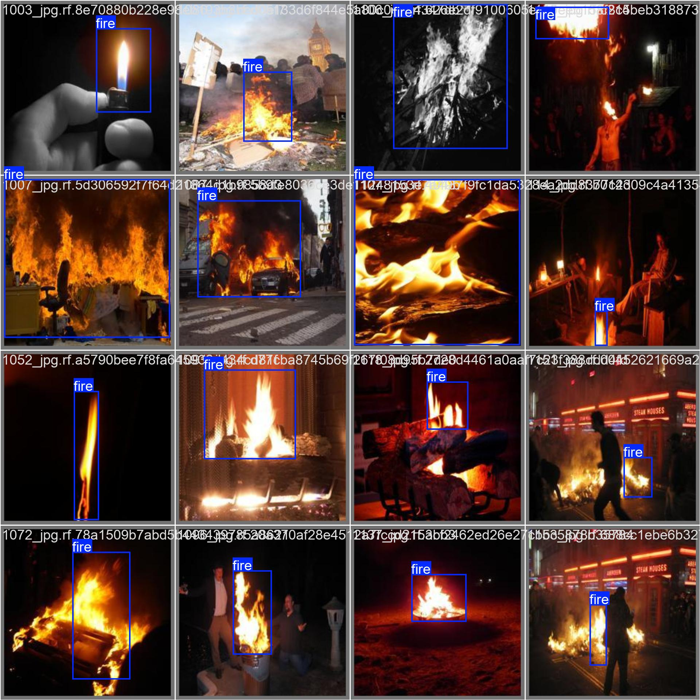
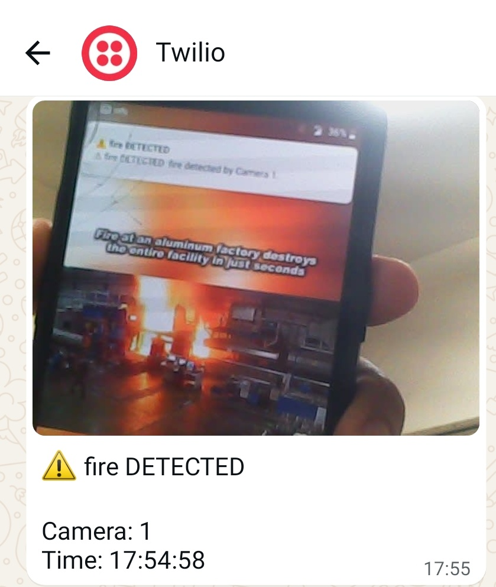

# 🔥 AI Fire Detection & Alert System

An AI-powered **real-time fire detection system** using **YOLO object detection** and a webcam.

The system continuously monitors a webcam feed, detects fire using a custom-trained YOLO model, and automatically sends an alert through **WhatsApp using Twilio** and **NTFY** when fire is detected.

<div align="center">

</div>


---

## 🚀 Project Overview

Early detection of fire is critical for preventing damage to people, equipment, and infrastructure.

This project uses computer vision and deep learning to automatically detect fire from a live webcam feed.

<div align="center">

</div>


### System Workflow

```text
                 ┌─────────────────────┐
                 │   Fire Image Dataset │
                 └──────────┬──────────┘
                            │
                            ▼
                 ┌─────────────────────┐
                 │    YOLO Training    │
                 │ Custom Fire Dataset │
                 └──────────┬──────────┘
                            │
                            ▼
                 ┌─────────────────────┐
                 │      best.pt        │
                 │   Trained YOLO      │
                 │       Model         │
                 └──────────┬──────────┘
                            │
                            ▼
                 ┌─────────────────────┐
                 │       Webcam        │
                 │   Live Video Feed   │
                 └──────────┬──────────┘
                            │
                            ▼
                 ┌─────────────────────┐
                 │   YOLO Inference    │
                 │   Fire Detection    │
                 └──────────┬──────────┘
                            │
                      Fire Detected
                            │
                 ┌──────────┴──────────┐
                 ▼                     ▼
          ┌──────────────┐      ┌──────────────┐
          │     NTFY     │      │    Twilio    │
          │ Notification │      │   WhatsApp   │
          └──────────────┘      └──────────────┘
```

---

## 🧠 AI Model

A custom YOLO model was trained using a dataset containing images of fire.

The training pipeline consists of:

```text
Fire Images
     │
     ▼
Image Annotation
     │
     ▼
Train / Validation / Test
     │
     ▼
YOLO Model Training
     │
     ▼
Trained Model
     │
     ▼
best.pt
```

The trained `best.pt` model is then used for real-time fire detection.

---

## 📂 Project Structure

```text
ai-fire-detection-whatsapp-ntfy-alert/
│
├── dataset/
│   ├── train/
│   │   ├── images/
│   │   └── labels/
│   │
│   ├── valid/
│   │   ├── images/
│   │   └── labels/
│   │
│   └── test/
│       ├── images/
│       └── labels/
│
├── fire_detection.py
├── best.pt
├── requirements.txt
├── .gitignore
└── README.md
```

> The dataset folder structure is included for reference. The actual training, validation, and test images are excluded from the GitHub repository.

---

## 🛠️ Technologies Used

| Technology | Purpose                            |
| ---------- | ---------------------------------- |
| Python     | Main programming language          |
| YOLO       | Fire detection                     |
| OpenCV     | Webcam and image processing        |
| PyTorch    | Deep learning framework            |
| NTFY       | Instant notifications              |
| Twilio     | WhatsApp alerts                    |
| Roboflow   | Dataset preparation and annotation |

---

## ⚙️ Installation

### 1. Clone the repository

```bash
git clone https://github.com/PukyBots/ai-fire-detection-whatsapp-ntfy-alert.git
cd ai-fire-detection-whatsapp-ntfy-alert
```

### 2. Create a virtual environment

```bash
python -m venv venv
```

Activate the environment on Windows:

```powershell
venv\Scripts\activate
```

### 3. Install dependencies

```bash
pip install -r requirements.txt
```

---

## 📦 Requirements

Example `requirements.txt`:

```text
ultralytics
opencv-python
numpy
requests
twilio
python-dotenv
```

---

## 🎥 Real-Time Fire Detection

Run the detection program:

```bash
python fire_detection.py
```

The program will:

1. Open the webcam.
2. Capture live video frames.
3. Run YOLO inference on each frame.
4. Detect fire in the camera feed.
5. Draw a bounding box around detected fire.
6. Display the detection confidence.
7. Trigger an alert when fire is detected.
8. Send a notification through NTFY.
9. Send a WhatsApp alert using Twilio.

---

## 🔥 Fire Detection

When fire is detected, the YOLO model identifies the fire region and displays a bounding box.

Example:

```text
┌──────────────────────────────────────┐
│                                      │
│        ┌─────────────────┐           │
│        │      FIRE       │           │
│        │   Confidence    │           │
│        │      91%        │           │
│        └─────────────────┘           │
│                                      │
│             Webcam Feed              │
│                                      │
└──────────────────────────────────────┘
```

The confidence threshold can be adjusted in the Python program depending on the required detection sensitivity.

---

## 🔔 NTFY Notification

When fire is detected, the system sends an instant notification through NTFY.

Example notification:

```text
🔥 FIRE DETECTED!

Fire has been detected by the AI monitoring system.

Please check the monitored area immediately.
```

The notification can be received on a smartphone or desktop using NTFY.

---

## 📱 WhatsApp Alert

The system also sends an alert through **WhatsApp using Twilio**.

Example:

```text
🚨 FIRE ALERT 🚨

Fire has been detected by the AI monitoring system.

Please check the monitored area immediately.
```

This allows the system to notify a responsible person remotely even when they are not directly monitoring the webcam.

---

## 🔐 API Keys & Security

API credentials should **never be stored directly inside the Python source code** or uploaded to GitHub.

The project uses environment variables through a `.env` file.

Example:

```env
TWILIO_ACCOUNT_SID=your_account_sid
TWILIO_AUTH_TOKEN=your_auth_token
TWILIO_WHATSAPP_FROM=whatsapp:+14155238886
TWILIO_WHATSAPP_TO=whatsapp:+91XXXXXXXXXX

NTFY_TOPIC=your_ntfy_topic
```

The `.env` file should be included in `.gitignore`:

```gitignore
.env
.env.*
```

### ⚠️ Never upload

```text
.env
Twilio Auth Token
Twilio Account SID
Private phone numbers
API keys
Passwords
```

---

## 📁 Dataset

The YOLO model was trained using a custom fire detection dataset.

The dataset is divided into:

```text
train/
valid/
test/
```

### Training

Used to train the YOLO model.

### Validation

Used during training to evaluate model performance on unseen images.

### Test

Used to evaluate the final trained model.

The actual images are **not included in this GitHub repository** to keep the repository lightweight and avoid unnecessary dataset distribution.

---

## 🎯 Key Features

* ✅ AI-based fire detection
* ✅ Custom YOLO-trained model
* ✅ Real-time webcam monitoring
* ✅ Fire bounding-box detection
* ✅ Confidence-based detection
* ✅ Automatic fire alerts
* ✅ NTFY notifications
* ✅ WhatsApp notifications
* ✅ Twilio integration
* ✅ Environment-variable-based API security

---

## 🔮 Future Improvements

Possible improvements include:

* 📷 CCTV/IP camera support
* 🎥 Multiple camera monitoring
* 📸 Send the detected fire image with the alert
* ☁️ Cloud-based monitoring
* 📊 Web dashboard
* 🔊 Local siren/alarm
* 🏭 Industrial fire monitoring
* 🚨 Automatic emergency escalation
* 👥 Multi-camera centralized monitoring
* 🌡️ Integration with temperature and smoke sensors

---

## 👨‍💻 Author

**Pulkit Garg**

Robotics & AI Engineer

This project demonstrates the application of **computer vision, deep learning, and IoT-based communication for real-time fire safety monitoring**.
